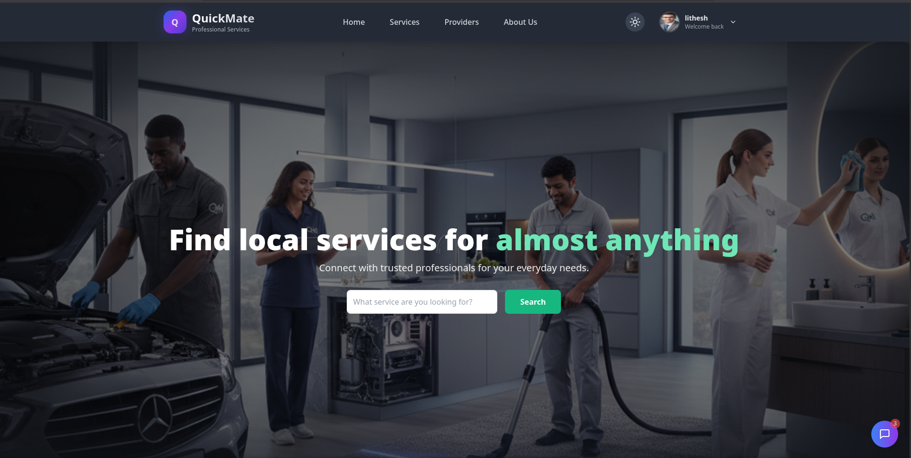

# 🎨 QuickMate - Client Application

The modern, responsive frontend for **QuickMate**, built to provide a seamless booking experience for Users, Service Providers, and Admins.

> **🔗 Backend Repository:** [Click here to view the Backend Code](https://github.com/Moosabilal/Quickmate-backend)

---

## 📸 Screenshots



---

## 🚀 Key Features
* **Interactive UI:** Built with React and Thailwind.
* **State Management:** Redux Toolkit is used for global state (Auth, User, Provider) to avoid prop-drilling and easy access.
* **Real-Time Chat:** Live messaging interface powered by Socket.IO client.
* **Video Calls:** Integrated WebRTC interface for in-browser video consultations.
* **Dashboards:** Three separate dashboards (Admin, User, Provider) with specialized charts and data visualization.

---

## 🛠️ Tech Stack
* **Framework:** React.js (Vite)
* **Language:** TypeScript
* **Styling:** Tailwind CSS
* **State Management:** Redux Toolkit

---

## ⚙️ Installation & Setup

1.  **Clone the repository**
    ```bash
    git clone https://github.com/Moosabilal/Quickmate-frontend.git
    cd quickmate-frontend
    ```

2.  **Install dependencies**
    ```bash
    npm install
    ```

3.  **Environment Variables**
    Create a `.env` file (or `.env.local` for Vite) in the root directory:
    ```env
    VITE_GOOGLE_CLIENT_ID=your google client id
    VITE_CLOUDINARY_CLOUD_NAME=your cloudinary cloud name
    VITE_RAZORPAY_KEY_ID = Enter your Razorpay key id
    VITE_BACKEND_URL= http://localhost:5000
    ```

4.  **Run the application**
    ```bash
    npm run dev
    ```

---

## 🤝 Contributing
Contributions are welcome! Please feel free to submit a Pull Request.

---

### 📬 Contact
**Moosa K A** [LinkedIn](www.linkedin.com/in/moosa-k-a-898300257) | [Portfolio](https://my-portfolio-eight-delta-akilc77lz3.vercel.app/)